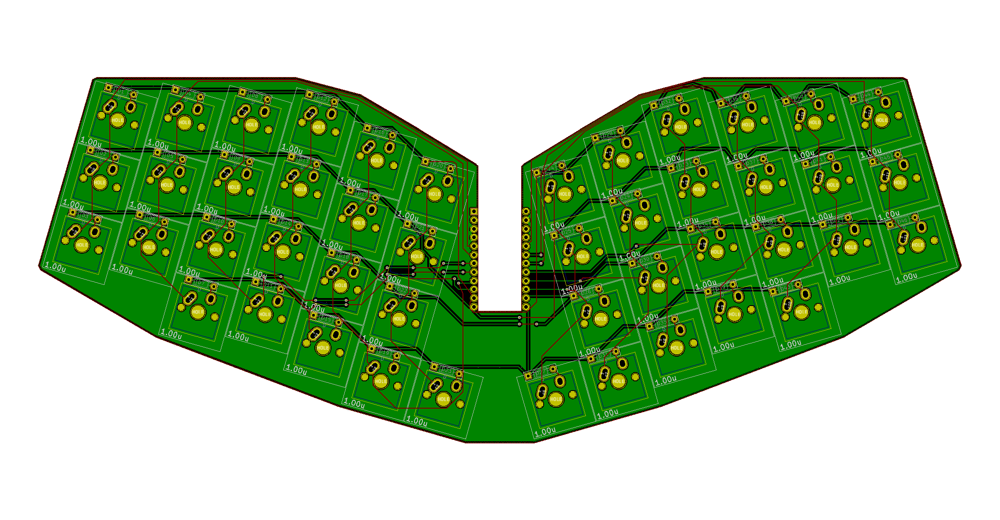

# eiri

Atreus-inspired 40% keyboard with 6 columns

## todo

- [x] case
- [ ] qmk
- [ ] via
- [ ] things
- [ ] stuff

## parts

| Qty | Thing |
|---|---|
| 46 | Switches |
| 46 | Diodes |
| 1 | Arduino Pro Micro |
| 1 | Pcb |
| some | bolts |
| and | acrylic |

## useful

[Kicad snapping angled footprints](https://github.com/TroyFletcher/kicad_snapping_angled_footprints)

